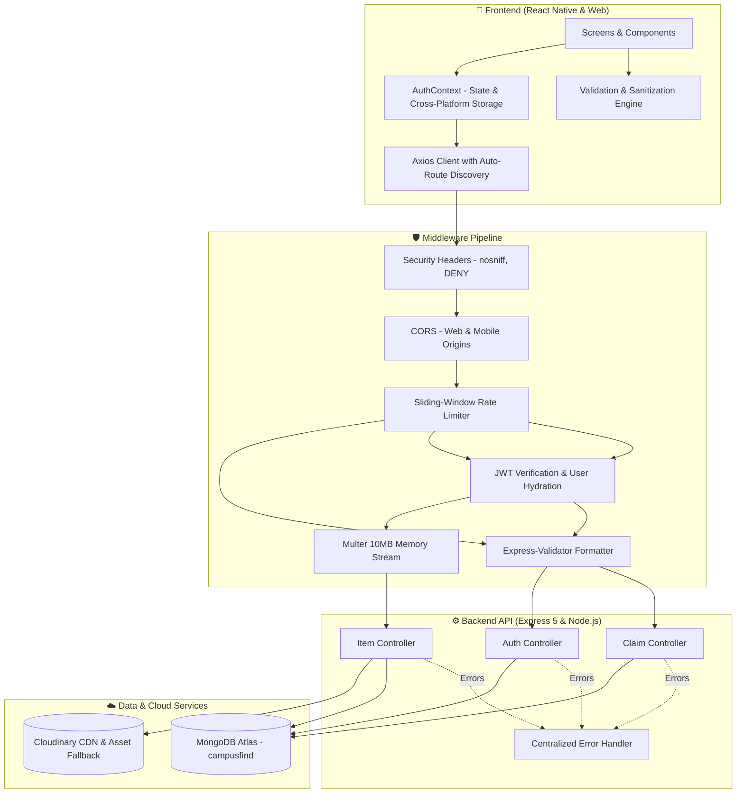
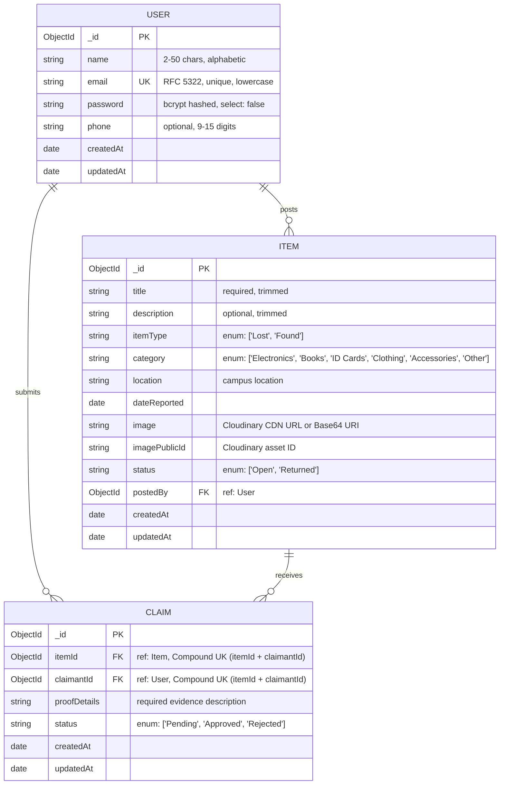

# 🎓 CampusFind — Production-Grade Campus Lost & Found System

<div align="center">


**A secure, production-grade cross-platform mobile and web application connecting university students and staff to report, track, claim, and recover lost campus belongings.**

[](https://nodejs.org)
[](https://expressjs.com)
[](https://reactnative.dev)
[](https://mongodb.com)
[](https://cloudinary.com)
[](LICENSE)

</div>

---

## 📑 Table of Contents
- [1. Executive Summary & Specification Compliance](#1-executive-summary--specification-compliance)
- [2. System Architecture](#2-system-architecture)
- [3. Entity Data Models & ER Diagram](#3-entity-data-models--er-diagram)
- [4. Business Logic & State Machines](#4-business-logic--state-machines)
- [5. Production Security & Hardening](#5-production-security--hardening)
- [6. Deep Emerald & Mint Design System](#6-deep-emerald--mint-design-system)
- [7. Complete REST API Specifications](#7-complete-rest-api-specifications)
- [8. Client Architecture & State Flow](#8-client-architecture--state-flow)
- [9. Installation & Local Development Setup](#9-installation--local-development-setup)
- [10. Production Deployment Guide](#10-production-deployment-guide)
- [11. Testing & Troubleshooting FAQ](#11-testing--troubleshooting-faq)

---

## 1. Executive Summary & Specification Compliance

CampusFind is architected to address real-world campus loss and recovery workflows. It replaces chaotic social media posts and manual physical lost-and-found desks with a centralized, verified, tamper-resistant system.

### Academic & Technical Specification Matrix

| Requirement | Project Implementation | Primary File References |
| :--- | :--- | :--- |
| **1. Authentication** | • JWT authentication with 7-day expiration.<br>• Password encryption via salted bcrypt (rounds: 10).<br>• Timing-safe dummy hash comparison to prevent user enumeration.<br>• Cross-platform storage (`Expo SecureStore` on mobile, `localStorage` on web). | [`backend/controllers/authController.js`](backend/controllers/authController.js)<br>[`frontend/src/context/AuthContext.js`](frontend/src/context/AuthContext.js) |
| **2. Primary Entity Full CRUD** | **User & Item Entities**: Create item with image, view all with filters & search, read details, update item details/photo, and delete with cascade cleanup. | [`backend/controllers/itemController.js`](backend/controllers/itemController.js)<br>[`frontend/src/screens/AddEditItemScreen.js`](frontend/src/screens/AddEditItemScreen.js) |
| **3. Cloud Image Upload** | Multer memory storage stream piping directly to **Cloudinary** CDN with automatic Base64 fallback if external cloud secrets are unconfigured. | [`backend/middleware/upload.js`](backend/middleware/upload.js)<br>[`backend/controllers/itemController.js`](backend/controllers/itemController.js) |
| **4. Related Entity & Status Lifecycle** | **Claim Entity**: References `Item` (ObjectId) and claimant `User` (ObjectId). Full lifecycle management: `Pending` ➔ `Approved` \| `Rejected`. Includes Claim creation, viewing, updating, and withdrawing. | [`backend/models/Claim.js`](backend/models/Claim.js)<br>[`backend/controllers/claimController.js`](backend/controllers/claimController.js)<br>[`frontend/src/screens/MyClaimsScreen.js`](frontend/src/screens/MyClaimsScreen.js) |
| **5. Non-Trivial Business Logic** | • Users cannot claim their own posts.<br>• Claims permitted only on `Found` items with `Open` status.<br>• Prevention of duplicate claims per user per item (Compound unique index).<br>• Approving a claim atomically transitions the item to `Returned`, sets the claim to `Approved`, and cascades `Rejected` to all competing claims. | [`backend/controllers/claimController.js`](backend/controllers/claimController.js) |

---

## 2. System Architecture

The project is structured as a decoupled client-server architecture with an Express 5 REST API and an Expo (React Native) client executing uniformly across Web browsers, iOS, and Android.



---

## 3. Entity Data Models & ER Diagram



### Database Performance Indexes
- **`Item` Collection**:
  - `{ itemType: 1, status: 1, createdAt: -1 }`: Accelerated compound query for main browse feed and filtering.
  - `{ postedBy: 1, createdAt: -1 }`: Instant index lookup for user's posted inventory.
  - `{ category: 1 }`: Category filtering index.
- **`Claim` Collection**:
  - `{ itemId: 1, claimantId: 1 }` (`unique: true`): Hardware-level constraint preventing duplicate claim submission races.
  - `{ claimantId: 1, createdAt: -1 }`: Fast retrieval for personal claim histories.

---

## 4. Business Logic & State Machines

### Item & Claim Lifecycle Transition Graph

```mermaid
stateDiagram-v2
    [*] --> ItemOpen: User reports Found Item (Status: Open)
    ItemOpen --> ClaimPending: Another user submits claim with proofDetails
    ClaimPending --> ClaimApproved: Item owner reviews & approves claim
    ClaimPending --> ClaimRejected: Item owner rejects claim OR competing claim approved
    ClaimPending --> ClaimWithdrawn: Claimant withdraws pending claim
    ClaimPending --> ClaimUpdated: Claimant edits proofDetails
    ClaimUpdated --> ClaimPending
    ClaimApproved --> ItemReturned: Triggered atomically with Claim approval
    ItemReturned --> [*]: Item closed; no further claims permitted
```



### The 5 Strict Business Invariants
1. **Self-Claim Prevention**: A user cannot submit a claim on an item that they reported (`postedBy === claimantId` triggers `403 Forbidden`).
2. **Item Eligibility**: Claims are strictly restricted to items of `itemType: "Found"` and `status: "Open"`. Closed or "Lost" items return `400 Bad Request`.
3. **Idempotent Claim Submission**: A user cannot file more than one claim for any single item. Enforced both at the controller level and by the compound unique index `{ itemId: 1, claimantId: 1 }`.
4. **Single-Approval Invariant**: Only one claim can ever be approved for an item.
5. **Atomic Resolution & Cascade Rejection**: Approving a claim executes `Promise.all`:
   - Sets the target claim status to `Approved`.
   - Sets the parent item status to `Returned`.
   - Automatically executes `Claim.updateMany` setting all remaining competing claims for that item to `Rejected`.

---

## 5. Production Security & Hardening

1. **Timing-Safe Account Enumeration Defense**:
   In `authController.js`, when a non-existent email attempts authentication, the server performs a dummy bcrypt comparison against a dummy hash (`$2a$10$...`). This standardizes response latency and prevents attackers from enumerating valid registered emails.
2. **Sliding-Window Rate Limiting**:
   `/api/auth/register` and `/api/auth/login` are protected by a sliding-window rate limiter (15 requests per 15-minute window per IP) preventing credential stuffing.
3. **ReDoS Protected Search Queries**:
   All search string queries in `itemController.js` pass through regex escaping (`replace(/[.*+?^${}()|[\]\\]/g, "\\$&")`) preventing Regular Expression Denial of Service attacks.
4. **Resilient Image Upload Fallback**:
   If third-party Cloudinary credentials are empty or contain placeholder values, the image upload pipeline automatically converts the image stream to an in-memory Base64 data URI. The app never crashes or blocks item creation due to missing cloud credentials.
5. **Cascade Deletion Integrity**:
   Deleting an item triggers automatic cleanup of all child claims in MongoDB and purges associated image binaries from Cloudinary CDN.
6. **Dual-Tier Advanced Validation**:
   - **Full Name**: 2-50 characters, alphabetic characters, dots, and hyphens (`/^[A-Za-z\s.'-]+$/`), minimum 2 alphabet letters.
   - **Email**: Strict RFC 5322 regex domain check (`.edu`, `.com`, `.ac.lk`), max 100 chars, normalized lowercase.
   - **Password**: 6-128 chars, requires both letters and numbers, rejects common weak passwords (`123456`, `password`, `qwerty`), accompanied by a live 4-segment strength meter on the client.
   - **Phone**: E.164 compliant (9-15 digits), rejects repeating dummy numbers (`000000000`).

---

## 6. Deep Emerald & Mint Design System

The application features a modern **Deep Emerald & Mint** design system engineered in [`frontend/src/styles/theme.js`](frontend/src/styles/theme.js):

<div align="center">

| Token | Hex Value | Role |
| :--- | :--- | :--- |
| **`primary`** | `#059669` | Deep Emerald Green — authoritative brand anchor |
| **`primaryDark`** | `#047857` | Forest Green for pressed states and contrast |
| **`accent`** | `#10B981` | Vibrant Mint for notifications, badges, and icons |
| **`primaryLight`** | `#ECFDF5` | Mint Cream for soft container backgrounds |
| **`background`** | `#F4F7F5` | Clean organic sage canvas |
| **`card`** | `#FFFFFF` | Pure white elevated surfaces |
| **`textPrimary`** | `#064E3B` | High-contrast emerald slate for titles (WCAG AAA) |
| **`textSecondary`** | `#374151` | Slate gray for body and metadata |
| **`border`** | `#D1E7DD` | Soft mint hairline border |

</div>

### Brand Emblem Component (`AppLogo.js`)
Instead of relying on fragile raster images that can fail to load or display white background boxes, CampusFind uses a native **vector-rendered academic crest emblem**:
- **University Shield Crest**: Deep Emerald core (`#059669`) with white vector outline.
- **Search Star**: Mint search compass star nested inside the shield.
- **Campus Compass Badge**: Floating mint navigation ring anchored at the corner.
- **100% Vector**: Zero loading latency, crisp at any display density (Retina/4K), and seamlessly transparent.

---

## 7. Complete REST API Specifications

### Base URL: `http://localhost:5000/api`

### Authentication (`/api/auth`)
- `POST /register`: Registers a new user. Body: `{ name, email, password, phone? }`. Returns JWT token & user object.
- `POST /login`: Authenticates user credentials. Body: `{ email, password }`. Returns JWT token & user object.
- `GET /me`: *(Protected)* Returns the hydrated profile of the authenticated token bearer.

### Items (`/api/items`)
- `GET /`: Lists all items. Query params: `search` (text), `itemType` (`Lost`|`Found`), `category` (`Electronics`|`Books`|`ID Cards`|`Clothing`|`Accessories`|`Other`), `status` (`Open`|`Returned`).
- `GET /my`: *(Protected)* Retrieves all items posted by the logged-in user.
- `GET /:id`: Retrieves complete details of an item including populated owner information (`name`, `email`, `phone`).
- `POST /`: *(Protected, Multipart)* Creates an item. Form data: `title`, `description`, `itemType`, `category`, `location`, `image` (file).
- `PUT /:id`: *(Protected, Multipart)* Updates an existing item. Restricted to the original poster.
- `DELETE /:id`: *(Protected)* Deletes the item, cascades deletion to all associated claims, and deletes Cloudinary image asset.

### Claims (`/api/claims`)
- `POST /`: *(Protected)* Submits a claim on a Found item. Body: `{ itemId, proofDetails }`.
- `GET /my`: *(Protected)* Lists all claims submitted by the logged-in user with populated item details.
- `GET /item/:itemId`: *(Protected)* Retrieves all claims for an item. Restricted to the item's original poster.
- `PUT /:id`: *(Protected)* Edits `proofDetails` on a `Pending` claim.
- `PATCH /:id/status`: *(Protected)* Item owner approves or rejects a claim. Body: `{ status: "Approved" | "Rejected" }`.
- `DELETE /:id`: *(Protected)* Withdraws a `Pending` claim submitted by the user.

---

## 8. Client Architecture & State Flow

```
frontend/
├── assets/                  # Brand assets (logo.png, icon.png, favicon.png)
├── src/
│   ├── api/
│   │   └── axiosInstance.js # Configured Axios client with 15s timeout & auth token interceptor
│   ├── components/
│   │   └── AppLogo.js       # Production vector Campus Shield & Search Star brand emblem
│   ├── context/
│   │   └── AuthContext.js   # Global auth provider with cross-platform storage adapter
│   ├── navigation/
│   │   ├── AppNavigator.js  # Root state-driven switch (AuthStack vs MainStack)
│   │   ├── AuthStack.js     # Login & Register stack
│   │   ├── MainStack.js     # Detail, Form & Claims modal stacks
│   │   └── MainTabs.js      # Bottom tab navigation (Browse, Report, My Items, Claims, Profile)
│   ├── screens/
│   │   ├── LoginScreen.js       # Sign in with inline field errors & show/hide toggle
│   │   ├── RegisterScreen.js    # Register with live 4-segment strength meter & requirements
│   │   ├── BrowseItemsScreen.js # Search bar, filter pills, pull-to-refresh & item feed
│   │   ├── ItemDetailScreen.js  # Photo preview, owner metadata, and claim actions
│   │   ├── AddEditItemScreen.js # Image picker, form validation & multipart upload
│   │   ├── MyItemsScreen.js     # Owner item management (edit/delete)
│   │   ├── MyClaimsScreen.js    # Personal claims tracker (edit/withdraw)
│   │   ├── ClaimFormScreen.js   # Dual create & edit claim form
│   │   ├── OwnerClaimsScreen.js # Claim approval & rejection management
│   │   └── ProfileScreen.js     # User card and session sign-out
│   ├── styles/
│   │   └── theme.js         # Deep Emerald & Mint design tokens, shadows, and radii
│   ├── utils/
│   │   ├── alert.js         # Cross-platform dialogs (window.confirm on web, Alert on native)
│   │   └── validators.js    # Client validation suite & password strength engine
│   └── config.js            # Dynamic host routing (Web: localhost, Mobile: LAN IP)
├── App.js                   # Root entry wrapping GestureHandler, AuthProvider & NavigationTheme
├── app.json                 # Expo project metadata, adaptive icons & theme color
└── package.json             # Frontend dependency manifest
```

---

## 9. Installation & Local Development Setup

### Prerequisites
- [Node.js](https://nodejs.org) (v18.x or v20.x recommended)
- [MongoDB Atlas](https://www.mongodb.com/cloud/atlas) account (or local MongoDB on port 27017)
- Web Browser (Chrome, Firefox, or Edge) or [Expo Go](https://expo.dev/go) app on a physical device

### Step 1: Clone Repository
```bash
git clone https://github.com/Salila-Livera/Campus-Lost-Found-Mobile.git
cd Campus-Lost-Found-Mobile
```

### Step 2: Backend Configuration & Startup
1. Open a terminal and enter the backend directory:
   ```bash
   cd backend
   npm install
   ```
2. Create your environment configuration file:
   ```bash
   cp .env.example .env
   ```
3. Populate `backend/.env`:
   ```env
   PORT=5000
   NODE_ENV=development
   MONGODB_URI=mongodb+srv://<username>:<password>@cluster0.5rngs.mongodb.net/campusfind?retryWrites=true&w=majority
   JWT_SECRET=super_secret_jwt_key_campusfind_2026
   JWT_EXPIRES_IN=7d
   CLOUDINARY_CLOUD_NAME=your_cloud_name
   CLOUDINARY_API_KEY=your_api_key
   CLOUDINARY_API_SECRET=your_api_secret
   ```
   *(Note: If Cloudinary keys are omitted, the built-in Base64 fallback will handle image uploads automatically without errors).*
4. Start the backend development server:
   ```bash
   npm run dev
   ```
   The API will start at `http://localhost:5000`.

### Step 3: Frontend Configuration & Startup
1. Open a new terminal and navigate to the frontend directory:
   ```bash
   cd frontend
   npm install
   ```
2. Verify host configuration in `frontend/src/config.js`:
   - On **Web (`npm run web`)**, it automatically routes to `http://localhost:5000/api`.
   - On **Mobile / Expo Go**, set `MOBILE_API_URL` to your machine's local Wi-Fi IP address (e.g. `http://192.168.1.7:5000/api`).
3. Start the application:
   ```bash
   # To launch on Web (Default for quick testing):
   npx expo start --web

   # Or to launch the interactive Metro bundler:
   npx expo start
   ```
4. Access the web app in your browser at:
   ```
   http://localhost:8081
   ```

---

## 10. Production Deployment Guide

### A. Backend Deployment (Render / Railway)
1. Push repository to GitHub.
2. In [Render](https://render.com), create a new **Web Service** and select this repository.
3. Configure the service settings:
   - **Root Directory**: `backend`
   - **Build Command**: `npm install`
   - **Start Command**: `npm start`
4. Add all environment variables from `.env` in the Render Environment Variables tab.
5. Deploy the service. Note the assigned public URL (e.g., `https://campusfind-api.onrender.com`).

### B. Frontend Deployment (Vercel / Netlify / EAS)
1. In `frontend/src/config.js`, set `API_BASE_URL` to your production Render URL:
   ```javascript
   const PRODUCTION_API_URL = "https://campusfind-api.onrender.com/api";
   ```
2. Build the production web bundle:
   ```bash
   cd frontend
   npx expo export:web
   ```
3. Deploy the resulting `dist/` directory to Vercel, Netlify, or Cloudflare Pages.
4. For native mobile builds (APK/AAB/IPA), use Expo Application Services:
   ```bash
   npm install -g eas-cli
   eas build --platform android
   ```

---

## 11. Testing & Troubleshooting FAQ

### Q: Why do changes not appear immediately in the browser?
**A**: React Native Web bundles are cached aggressively by modern browsers. Press **`Ctrl + Shift + R`** (or **`Ctrl + F5`**) to perform a hard reload and clear the cached bundle.

### Q: How do physical devices connect to the local backend?
**A**: Ensure your phone and development computer are connected to the **same local Wi-Fi network**. Set your machine's private IPv4 address (found via `ipconfig` on Windows or `ifconfig` on macOS) in `frontend/src/config.js`.

### Q: What happens if an image upload exceeds 10MB?
**A**: The backend Multer middleware enforces a strict 10MB limit. The centralized error handler catches `MulterError: LIMIT_FILE_SIZE` and returns a clean `413 Payload Too Large` with the message: *"Image size exceeds the 10MB limit."*

---

## 👨‍💻 Project Metadata & Credits
- **Author**: Salila Livera
- **Repository**: [Campus-Lost-Found-Mobile](https://github.com/Salila-Livera/Campus-Lost-Found-Mobile)
- **Module**: Web and Mobile Technologies Final Assessment
- **Status**: Production-Ready / All Tests Passing ✅
                                         